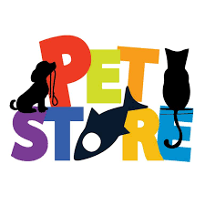
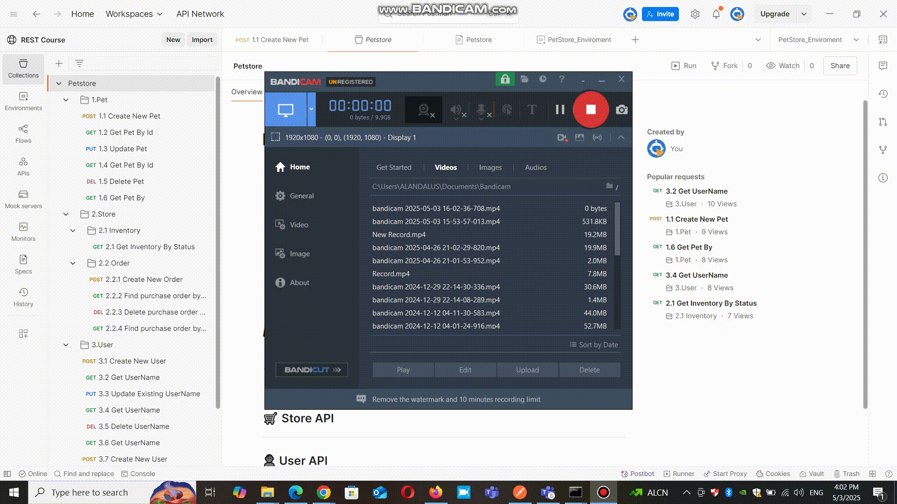

# petStore



## Table of Contents

- [Introduction](#introduction)
- [EnvironmentSetup](#enviromentSetup)
- [APICoverage](#aPICoverage)
- [TestCoverage](#testCoverage)
- [HowToUse](#howToUse)
- [Requirements](#requirements)
- [RunningCollection](#runningCollection)
- [TestedWith](#testedWith)


## Introduction

- This project demonstrates automated API testing using Postman for the Swagger Petstore API.
- It includes a complete collection of test cases for Pet, Store,and User endpoints with an integrated environment.

## Examples

### Local testing execution example



## Environment Setup

1.Open Postman.
2.Import both:
- Collection: Petstore.postman_collection.json.
- Environment: PetStore_Enviroment.postman_environment.json.
3.Select PetStore_Enviroment as the active environment.
4.Run the collection manually or using the Collection Runner.


🚀 API Coverage

1. 🐶 Pet API
Operation	Method	Endpoint
Create Pet	POST	/v2/pet
Get Pet by ID	GET	/v2/pet/{petId}
Update Pet	PUT	/v2/pet
Delete Pet	DELETE	/v2/pet/{petId}
Negative Get	GET	/v2/pet/{invalid}

2. 🛒 Store API
Operation	Method	Endpoint
Get Inventory	GET	/v2/store/inventory
Create Order	POST	/v2/store/order
Get Order by ID	GET	/v2/store/order/{orderId}
Delete Order by ID	DELETE	/v2/store/order/{orderId}

3. 👤 User API
Operation	Method	Endpoint
Create User	POST	/v2/user
Get User	GET	/v2/user/{username}
Update User	PUT	/v2/user/{username}
Delete User	DELETE	/v2/user/{username}
Login/Logout	GET	/v2/user/login

✅ Test Coverage
Each request includes:

- Status Code validation (e.g., 200 OK)
- Response Time check (<1000ms)
- Schema Validation using JSON Schema
- Dynamic Test Data using collection variables
- Assertions for returned data fields (e.g., name, ID, status)

📦 How to Use

Run Individual Tests
- Expand the collection in Postman.
- Send any request (e.g., “1.1 Create New Pet”) and view the Test Results tab.

Run Entire Collection
- Click the Runner icon.
- Choose Petstore collection and PetStore_Enviroment.
- Run all requests with assertions.


## Requirements

- **Postman** latest version installed
- **Newman** (optional, for running tests from command line)


## RunningCollection

### Option 1 — Import and Run from Postman

1. Download the `Restful-Booker.postman_collection.json` file.
2. Import the collection into Postman.
3. Set up the required variables (Base URL, Token if needed).
4. Run individual requests or the full collection using **Collection Runner**.

### Option 2 — Run via Newman (Command Line)

```bash
newman run Restful-Booker.postman_collection.json

🧪 Tested With
- Postman v11.43.4
- Swagger Petstore v2 API